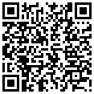

<div align="center">
   <a href="https://mxgfx.me">
      
   </a>
   <p><sub>
         Logo by <a href="https://mxgfx.me">MX Graphics</a>
   </sub></p>
   <h1>Polyseed Secret Sharing Tool 🤫 (PSST)</h1>

![Maintained][maintained-badge]
[![Make a pull request][prs-badge]][prs]
[![License][license-badge]](LICENSE)


[![Watch on GitHub][github-watch-badge]][github-watch]
[![Star on GitHub][github-star-badge]][github-star]

[](https://github.com/Unkn8wn69/psst?tab=readme-ov-file#donations)
</div>

This is a python gui tool that can be used to backup a monero polyseed using shared secrets by using [Shamir's Secret Sharing Scheme](https://en.wikipedia.org/wiki/Shamir%27s_secret_sharing). It uses Trezors python-shamir-mnemonic to generate mnemonic phrases. To also lower the amount of words per mnemonic phrase it only saves the seed's indexes in the [BIP-39](https://github.com/bitcoin/bips/blob/master/bip-0039/bip-0039-wordlists.md) wordlist and by that lowering the amount of words to ~24 per share.

## Motivation

In the realm of cryptocurrency, security is paramount, and it's often a personal responsibility. Traditional methods of storing seed phrases, even in multiple secure locations, have a critical vulnerability: if one location is breached, the entire wallet is at risk.

I've recently explored the effectiveness of Shamir's Secret Sharing Scheme, particularly for enhancing the security of seedphrases. Shamir Secret Sharing is a cryptographic method that allows a secret, such as a seedphrase, to be divided into multiple shares. The brilliance of this approach lies in its flexibility: the original secret can only be reconstructed when a predefined number of these shares are combined. This threshold mechanism ensures that the loss or compromise of a single share doesn’t expose the entire secret, significantly reducing the risk of a single point of failure.

It allows for a distributed and resilient form of protection. Additionally, users can employ advanced security measures like steganography to conceal these shares.

## Disclaimer

Important: This tool should only be used in a secure, air-gapped environment, like [TAILS](https://tails.net)

This project is in an early stage, and contributions are welcome.

## Features & Roadmap

* [X] Working GUI
* [X] pre-built binaries
* [X] Generate a set of secret shares (multiple groups, master threshold etc.)
* [X] Direct integration with Trezor's shamir-mnemonic for streamlined processes
* [ ] Passphrase protection
* [ ] Ability to generate secret shares from arbitrary data.
* [ ] Codebase enhancements for simplicity and clarity.

## Installation

1. Download the [latest release](https://github.com/Unkn8wn69/psst/releases) from the repo
2. Start the executable
3. (Linux only) Adjust execution permissions of the file

   `chmod +x psst`

## Building from source

0. Clone this repo and move into the directory

   ```
   git clone https://github.com/Unkn8wn69/psst
   cd psst
   ```
1. Install dependencies

   `pip install click customtkinter pillow`

   For externally managed environment on Arch:

   `sudo pacman -S python-click python-customtkinter python-pillow`
2. Install python-shamir-mnemonic

   `git clone https://github.com/trezor/python-shamir-mnemonic`
3. Start the tool

   `python gui.py`
4. (Optional) Compile using [PyInstaller](https://pyinstaller.org/)

   `pyinstaller --onefile --add-data "assets:assets" --add-data "wordlist.json:." --add-data "python-shamir-mnemonic/shamir_mnemonic:shamir_mnemonic" --paths=$(python -c "import customtkinter; print(customtkinter.__path__[0])") --hiddenimport PIL --hidden-import PIL._tkinter_finder --icon=assets/icon.ico --noconsole gui.py`

## Prerequisites for building from source

- Python 3.9+
- customtkinter, click and pillow pip-modules
- Trezors [python-shamir-mnemonic](https://github.com/trezor/python-shamir-mnemonic)

## Credits

- Trezor [python-shamir-mnemonic](https://github.com/trezor/python-shamir-mnemonic)
- [iancoleman](https://github.com/iancoleman/slip39) for inspiration from his https://iancoleman.io/slip39/
- Special thanks to [MX Graphics](https://mxgfx.me) for the Logo!

## Donations

If you find this project useful, please consider donating to the following Monero address: (Or for other cryptos [here](https://trocador.app/anonpay/?ticker_to=xmr&network_to=Mainnet&address=89ZYSD9nyFxZS1zrZaB9Z4giuv776AeKTMXVRWPMkZDtau7wF2DCgqc1tH9zAVszPTP9XTSnhLT4rYUhW6oP8okeS56Jbdc&donation=True&simple_mode=True&name=Unkn8wn69))

<p align="center">
 <br>
 <code>89ZYSD9nyFxZS1zrZaB9Z4giuv776AeKTMXVRWPMkZDtau7wF2DCgqc1tH9zAVszPTP9XTSnhLT4rYUhW6oP8okeS56Jbdc</code>
</p>

## License

This project is released under the terms of the GPL 3.0 license. For more information, see the [LICENSE](LICENSE) file included in the repository.

[maintained-badge]: https://img.shields.io/badge/maintained-yes-brightgreen
[license-badge]: https://img.shields.io/badge/license-GPL-blue.svg
[prs-badge]: https://img.shields.io/badge/PRs-welcome-red.svg
[prs]: http://makeapullrequest.com

[github-watch-badge]: https://img.shields.io/github/watchers/everoddandeven/monerod-gui.svg?style=social
[github-watch]: https://github.com/everoddandeven/monerod-gui/watchers
[github-star-badge]: https://img.shields.io/github/stars/everoddandeven/monerod-gui.svg?style=social
[github-star]: https://github.com/everoddandeven/monerod-gui/stargazers

[bitcoin-donated]: https://github.com/everoddandeven/monerod-gui?tab=readme-ov-file#bitcoin
